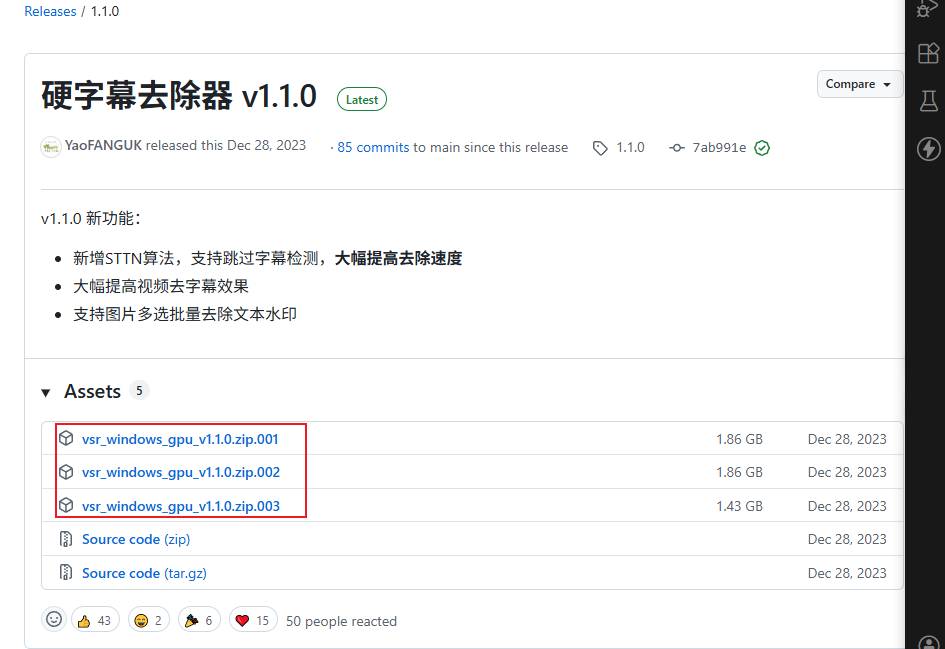
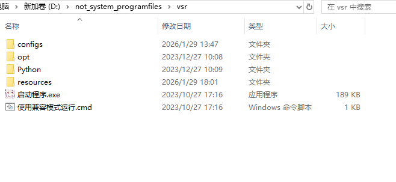
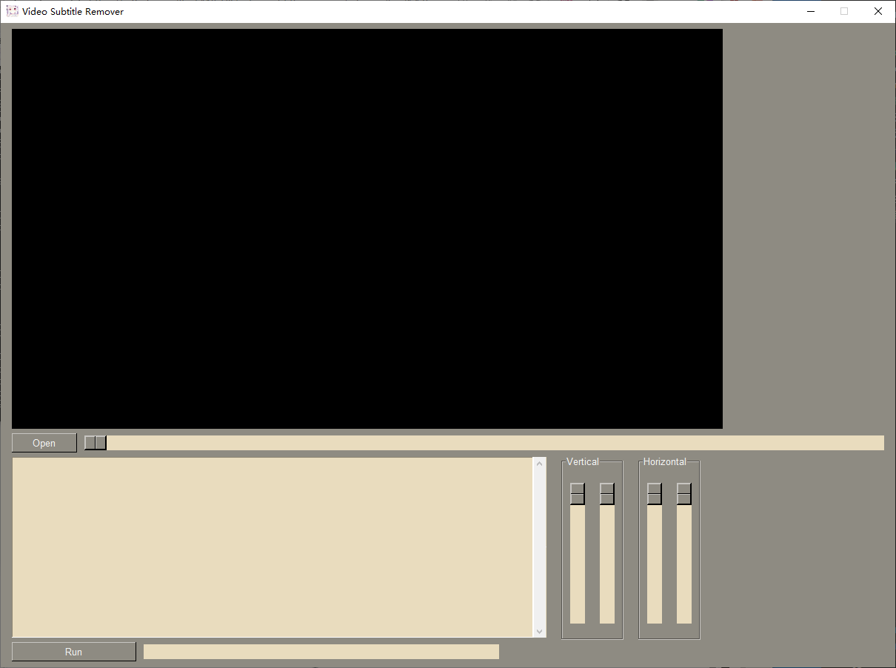
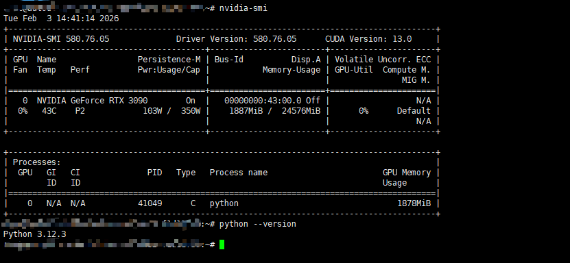
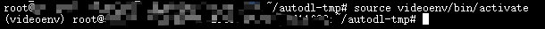
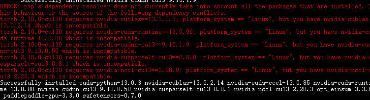
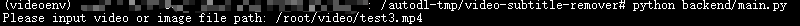
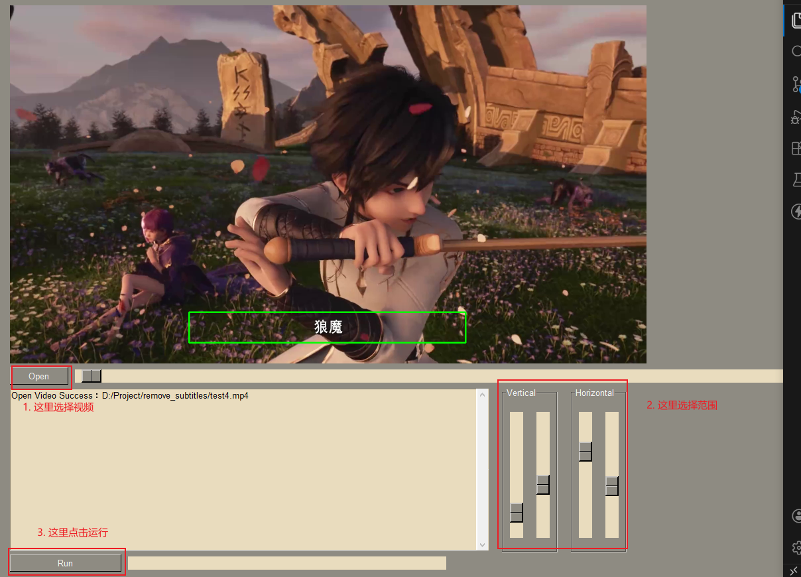
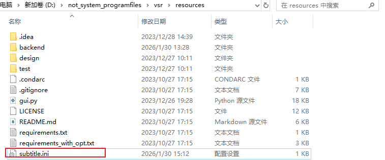

# 字幕移除项目部署

## windows本地部署
1. 进入`https://github.com/YaoFANGUK/video-subtitle-remover`,点击
   
2. 下载3个分卷压缩包
   
3. 使用7z或等软件合并压缩,最后得到
   
4. 点击`启动程序`,等待初始化(时间较长),最后
   

## Linux远程服务器部署

### 若服务器支持docker
则直接按照下面使用docker部署
```cmd
# Windows PowerShell
cd d:\Project\video-subtitle-remover

# 构建 CUDA 12.8 版本（默认）
sudo docker build -f docker/Dockerfile -t video-subtitle-remover:cu12.8 .

# 或者构建 CUDA 13.0 版本（需要确保 Dockerfile 中的 CUDA 版本支持）
sudo docker build -f docker/Dockerfile -t video-subtitle-remover:cu13.0 --build-arg CUDA_VERSION=13.0 .

```

运行：
```# 运行容器（需要 GPU 支持）
sudo docker run -it --gpus all -v d:\videos:/videos video-subtitle-remover:cu12.8
```

### 若服务器不支持docker

#### 克隆项目
原项目地址:`https://github.com/YaoFANGUK/video-subtitle-remover`

使用此fork:`git clone https://github.com/Fallenstarstwice/video-subtitle-remover.git`

>为什么使用此fork而非原项目地址: 原项目使用命令行操作没有选择字幕区域的功能,且依赖并没有更新,导致使用`cuda 13.0`等较新版本时会遇到依赖的版本冲突问题.尽管如此,若觉得有用,请star原项目以支持作者.

#### 前置
比如提供的是jupyterlab或notebook,是一个容器化的环境,则按照以下方式从源码部署.<br>
1. 检查服务器是否安装cuda,python等(租带显卡的 提供jupyterlab的服务器基本都会安装cuda,conda,python等)
```cmd
# 检查cuda
nvidia-smi

# 检查python
python --version
```
若未安装,请搜索cuda,cuDNN等自行安装.<br>
这里使用的环境为`cuda 13.0`,`python 3.12`:


2. 虚拟环境
   1. 创建虚拟环境的方法有很多,这里我们使用python创建名为`videoenv`的虚拟环境
      ```
      python -m venv videoenv
      ```

   2. 激活虚拟环境
      ```
      source videoenv/bin/activate
      ```
       

   3. 加载到项目根目录,安装依赖:
      ```
      pip install -r requirements.txt
      ```
   
3. 安装padlepadle-GPU(`cuda 13.0`),请安装与设备上cuda版本对应的 版本:
```
python -m pip install paddlepaddle-gpu==3.3.0 -i https://www.paddlepaddle.org.cn/packages/stable/cu130/
```

4. 安装与cuda版本对应的torch, 这里使用的是`cuda 13.0`
```
pip3 install torch==2.10.0 torchvision --index-url https://download.pytorch.org/whl/cu130
```


若报错显示`nvidia-nccl-cu13`版本过旧,忽略即可,可以正常运行


>新的cuda可以向下兼容旧的版本,但旧的版本不能兼容新的版本
>比如显示`xx需要的nccl为12.6, 但当前为12.8`,这种情况是可以运行的,但反过来不行(一般)
>又比如,当cuda版本为`12.8`时,此时`paddlepaddle-gpu==3.3.0`没有对应的cuda版本,可以按照官网装旧的`cuda 12.6`版本,但需要先装paddlepaddle再装torch(`torch`有对应的`cuda 12.8`版本),不然部分新版本的依赖库会被旧版本顶掉

## 使用
### 处理视频
部署在linux上无法使用GUI界面,在项目根目录激活虚拟环境后输入`python backend/main.py`


然后输入视频路径,例如图片中输入`/root/video/test3.mp4`

### 选择字幕区域
选择字幕区域的识别范围:
`backend/subtitle_area.yaml`, 默认识别视频全部.
```yaml
# 左上角为坐标原点,坐标轴垂直向下为y正方向,水平朝右为x正方向

Y : 0.0  # Y轴起始位置（像素）
H : 1.0  # 高度（像素）
X : 0.0  # X轴起始位置（像素）
W : 1.0  # 宽度（像素）
```
不确定该选哪个范围可以先使用windows便携版的GUI界面,自己选定范围,点击运行


等项目开始处理视频时,关闭项目,找到`subtitle.ini`,根据里面的值修改`backend/subtitle_area.yaml`的值(**注意,ini里面是等于号, yaml文件里面是 冒号**)



选择字幕区域的好处:
1. 缩小识别范围降低计算量,加快计算速度.
2. 模型会对字幕, 甚至非字幕区域进行涂抹, 选择字幕区域能够减小涂抹范围.

### 修改算法
修改backend/config.py中的参数，尝试不同的去除算法，算法介绍
```md
- InpaintMode.STTN 算法：对于真人视频效果较好，速度快，可以跳过字幕检测
- InpaintMode.LAMA 算法：对于图片效果最好，对动画类视频效果好，速度一般，不可以跳过字幕检测(消耗时间大概为STTN的5倍)
- InpaintMode.PROPAINTER 算法： 需要消耗大量显存，速度较慢，对运动非常剧烈的视频效果较好
```